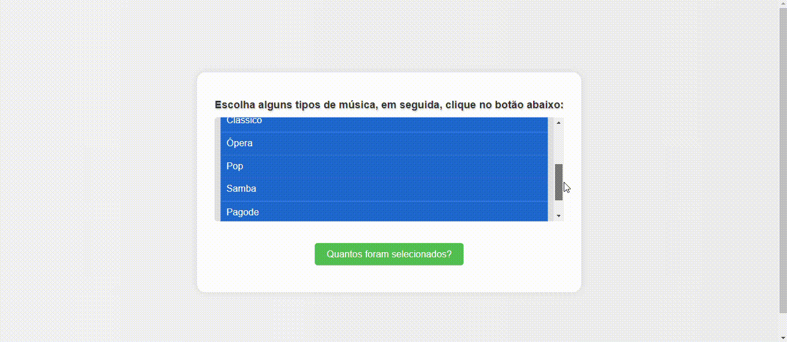

## Seletor de tipos musicais
O site é extremamente simples. Tendo um design simples e compreensivel. No site é possível ver a variação de 10 estilos musicais e um botão escrito "Quantos foram selecionados".
 
## Função
O site tem a finalidade simples de você poder selecionar os estilos musicais que estão presentes no site. Após selecionar você pode clicar no botão "Quantos foram selecionados" e ele dirá quantos tipos você escolheu.
 

 
## Laços e interações
O site foi criado durante as aulas de Web design 1 instruidas pelo professor Leornado Santiago. Ele tem a função de treinar a função de Laços e interações.
 
## Tecnologias utilizadas
 
```HTML 5```

```CSS 3```

```Java Script```

```Github```

```VsCode```

```Microsoft Teams```
 
##
Autor: Kleyverson de Oliveira Sampaio